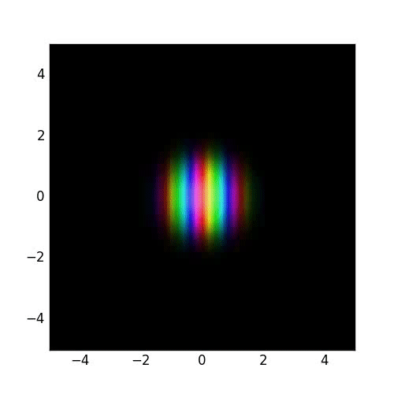
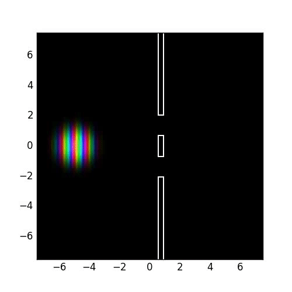
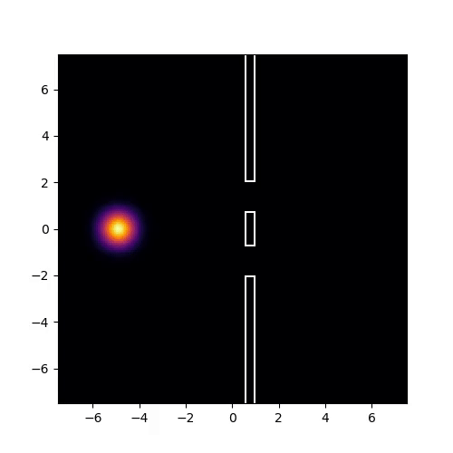

# Python-2D-Simulation-of-Schrodinger-Equation

Une simulation de l'évolution d'un paquet d'onde gaussien 

## Fonctionnement 

Le programme simule le comportement d'un paquet d'onde gaussien suivant l'équation de Schrödinger. L'algorithme utilisé est la méthode [Alternating direction implicit method](https://en.wikipedia.org/wiki/Alternating_direction_implicit_method). 

La simulation permet de configurer un potentiel constant avec le temps ainsi que la présence d'obstacles (qui sont gérés comme des barrières de potentiel très élévées).

La fonction d'onde complexe est affichée en convertissant les nombres complexes en format de couleur *HSV*.
### Perfomance

Pour une grille 200x200 à 25 *fps*, il faut compter une minute de calcul par seconde d'animation

## Utilisation 

Pour créer une animation et la stocker dans le ficher *nomDuFichier.mp4*, il faut utiliser la commande suivante : 
```console
python main.py nomDufichier
```
Si l'on veut afficher la densité de probalité et non pas la fonction d'onde complexe, il faut ajouter le flage *--intensity*.
```console
python main.py nomDufichier --intensity
```
## Configuration

Le fichier *config.toml* permet de configurer la simulation et le rendu, les paramètres sont :
* FPS : Le nombre d'image par seconde de l'animation
* DURATION : Le temps en seconde de la simulation
* SIZE : Choisit l'échelle 
* N : Le taille de la grille en nombre de point (ce qui correspont à N^2 points)
* DELTA_T : Le temps de simulation écoulé par seconde d'animation
* x , y : Les positions de départ du paquet d'onde
* Kx, Ky : Ses nombres d'onde
* Ax, Ay : Ses facteurs d'étalements selon x et y
* V : L'expression du potentiel
* O : L'expression de la présence d'obstacles

Le potentiel et la présence d'obstacle doivent être exprimés comme des expressions Python valides dépendant de *x* et *y* (valant respectivement un *float* et un *boolean*) car le progamme utilise la fonction Python *eval()* pour les évaluer.

## Dépendances

Le progamme nécessite les bibliothèques Python : *numpy*, *scipy*, et *matplotlib* ainsi que *toml*.
Il necéssite aussi FFmpeg pour pouvoir enregister la vidéo.

## Exemples 
##### Un paquet d'onde dans un potentiel quadratique 


##### Interférence à travers une double fente 


##### La densité de probabilité à travers la double fente 


